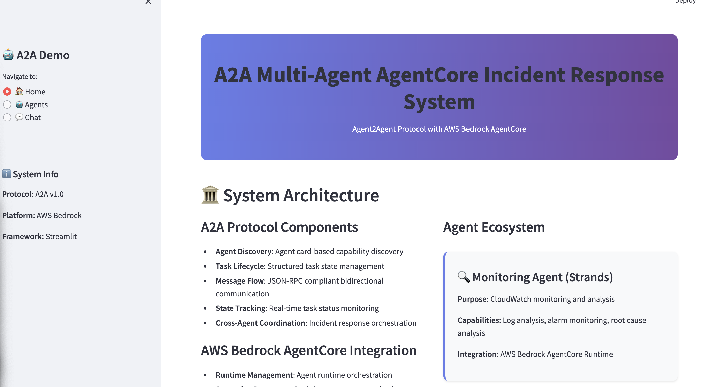
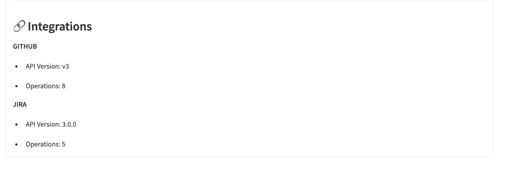
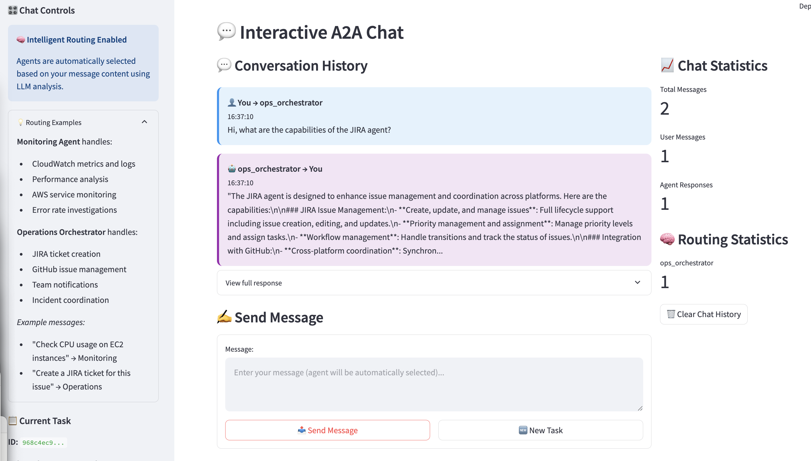
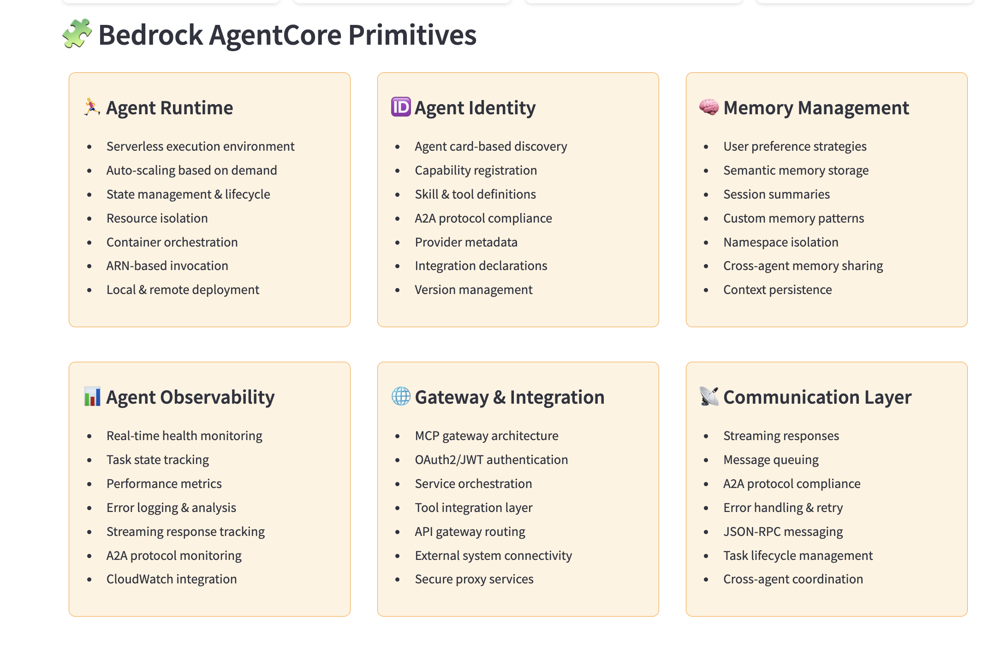

# Multi-Agent System with AWS Bedrock AgentCore, OpenAI and Strands SDK: Comprehensive Guide

❗❗ NOTE: This repository contains heavy detail, multiple SDKs and integrations. This repository is under construction and can be re-used for various applications.❗❗



## Table of Contents
1. [System Overview](#system-overview)
2. [Architecture Deep Dive](#architecture-deep-dive)
3. [Monitoring Agent](#monitoring-agent)
4. [Ops Orchestrator Agent](#ops-orchestrator-agent)
5. [AWS Bedrock AgentCore Primitives](#aws-bedrock-agentcore-primitives)
6. [Setup and Configuration](#setup-and-configuration)
7. [Deployment Guide](#deployment-guide)
8. [Usage Examples](#usage-examples)
9. [Troubleshooting](#troubleshooting)
10. [Best Practices](#best-practices)

A comprehensive multi-agent system built on AWS Bedrock AgentCore for automated operations, monitoring, and incident management.

## 📖 Documentation

For comprehensive documentation, visit our **[GitHub Pages Documentation Site](https://madhurprash.github.io/A2A-Multi-Agents-AgentCore/)**

The documentation includes:
- [Complete system overview](https://madhurprash.github.io/A2A-Multi-Agents-AgentCore/)
- [Monitoring Agent guide](https://madhurprash.github.io/A2A-Multi-Agents-AgentCore/monitoring-agent)
- [Ops Orchestrator Agent guide](https://madhurprash.github.io/A2A-Multi-Agents-AgentCore/ops-orchestrator-agent)
- Setup instructions and troubleshooting guides
- Security best practices

## Quick Overview

This repository contains two main agent systems:

### 🔍 Monitoring Agent
AWS Bedrock AgentCore runtime for monitoring CloudWatch logs, metrics, dashboards, and other AWS services.

### 🤝 Ops Orchestrator Agent  
Multi-agent system for automated incident triaging, ChatOps collaboration, and report generation.

## Getting Started

1. **Visit the [Documentation Site](https://madhurprash.github.io/A2A-Multi-Agents-AgentCore/)** for detailed setup instructions
2. Choose your agent based on your needs:
   - For AWS monitoring: Start with the Monitoring Agent
   - For operations management: Begin with the Ops Orchestrator Agent
3. Follow the step-by-step guides for configuration and deployment

## System Overview


This multi-agent system demonstrates sophisticated implementation of AWS Bedrock AgentCore primitives through two coordinated agents: a **Monitoring Agent** for AWS resource analysis and an **Ops Orchestrator Agent** for automated incident management and operations coordination.

### Key Features

**Enterprise-Grade Architecture**: Built on AWS Bedrock AgentCore with proper authentication, memory management, and observability
**Multi-Agent Collaboration**: Sophisticated agent-to-agent coordination for complex operational workflows
**Comprehensive AWS Integration**: Deep integration with CloudWatch, JIRA, GitHub, and other enterprise services
**Advanced Memory Management**: Persistent memory across sessions with semantic understanding and user preferences
**Secure Gateway Architecture**: MCP-based gateway with OAuth2/JWT authentication and proper access controls
**Production-Ready Deployment**: Supports both local development and managed cloud deployment modes

## Architecture Deep Dive

### System Components

```
┌─────────────────────────────────────────────────────────────┐
│                    AWS Bedrock AgentCore                    │
├─────────────────────────────────────────────────────────────┤
│  ┌─────────────────────┐    ┌─────────────────────────────┐ │
│  │   Monitoring Agent  │    │   Ops Orchestrator Agent   │ │
│  │                     │    │                             │ │
│  │ • CloudWatch Logs   │    │ • Lead Agent (Triaging)    │ │
│  │ • Metrics Analysis  │    │ • ChatOps Agent             │ │
│  │ • Dashboard Review  │    │ • Ticket Creator Agent     │ │
│  │ • Alarm Management  │    │ • Multi-Agent Coordination │ │
│  └─────────────────────┘    └─────────────────────────────┘ │
├─────────────────────────────────────────────────────────────┤
│                    Shared Infrastructure                    │
│  ┌─────────────────────────────────────────────────────────┐ │
│  │ • Memory Management (User Prefs, Semantic, Summary)    │ │
│  │ • MCP Gateway (Authentication, Tool Integration)       │ │
│  │ • Observability (OpenTelemetry, CloudWatch Logging)   │ │
│  │ • Runtime Management (AgentCore Runtime, Local Mode)  │ │
│  └─────────────────────────────────────────────────────────┘ │
└─────────────────────────────────────────────────────────────┘
```

### Agent Communication Patterns


The system supports multiple communication patterns:

**Direct Invocation**: Each agent can be invoked directly for specific tasks
**Agent-to-Agent (A2A)**: Agents can communicate with each other for coordinated workflows
**Gateway-Mediated**: All external service interactions go through the secure MCP gateway
**Memory-Shared**: Agents can access shared memory contexts for coordination

## Monitoring Agent

The Monitoring Agent serves as your AWS infrastructure's intelligent observer, providing comprehensive analysis and insights across your entire cloud environment.

### Core Capabilities

**CloudWatch Integration**: Complete integration with CloudWatch logs, metrics, dashboards, and alarms across all AWS services including EC2, Lambda, RDS, EKS, API Gateway, CloudTrail, S3, VPC, WAF, Bedrock, and IAM.

**Intelligent Analysis**: Uses advanced language models to analyze log patterns, identify anomalies, and provide actionable recommendations for issue resolution.

**Dashboard Management**: Can list, analyze, and summarize CloudWatch dashboards, helping you understand your monitoring setup and identify gaps.

**Alarm Coordination**: Retrieves and analyzes CloudWatch alarms, providing context about their triggers and suggesting remediation steps.

**Log Group Analysis**: Performs deep analysis of specific log groups, identifying patterns, error rates, and trends that might indicate system issues.

### Technical Implementation

**Foundation Model**: Claude 3.5 Sonnet with optimized inference parameters (temperature: 0.1, max_tokens: 2048) for analytical precision
**Memory Architecture**: Four-layer memory system including user preferences, semantic memory, session summaries, and custom monitoring issue tracking
**Tool Integration**: Smithy model specifications for AWS service integration and Lambda function tools for specialized monitoring capabilities
**Authentication**: AWS Cognito-based authentication with proper OAuth2 flows and token management

### Usage Patterns

The monitoring agent excels in several key scenarios:

**Incident Response**: When alerts fire, the agent can quickly analyze relevant logs, correlate with metrics, and provide initial assessment of the issue severity and potential root causes.

**Proactive Monitoring**: Regular analysis of system health across multiple dimensions, identifying trends and patterns that might indicate emerging issues before they become critical.

**Compliance and Auditing**: Systematic review of logs and metrics to ensure compliance with operational standards and identify security or performance anomalies.

**Knowledge Building**: Over time, the agent builds institutional knowledge about your infrastructure, learning from past incidents and improving its analysis capabilities.

## Ops Orchestrator Agent

The Ops Orchestrator Agent represents a sophisticated multi-agent collaboration system designed to automate and coordinate operational workflows across your organization.

### Multi-Agent Architecture

**Lead Agent (Issue Triaging)**: The orchestrator responsible for analyzing incidents, determining priority levels, and coordinating response actions. This agent maintains comprehensive understanding of your operational environment and can make intelligent decisions about resource allocation and escalation paths.

**ChatOps Agent**: Specialized in communication and collaboration, this agent integrates with Teams, Slack, and Gmail to provide real-time updates, coordinate team responses, and manage stakeholder communications throughout incident lifecycles.

**Ticket Creator Agent**: Handles automated ticket creation and management in JIRA and PagerDuty systems. This agent understands your ticketing workflows and can create properly formatted, well-categorized tickets with appropriate priority levels and assignments.

### Advanced Capabilities

**Intelligent Prioritization**: The system can analyze incoming issues and automatically prioritize them based on business impact, technical severity, and resource availability.

**Cross-Platform Integration**: Seamless integration with multiple external services including JIRA for ticket management, GitHub for code and documentation management, and various communication platforms for team coordination.

**Workflow Automation**: Complex multi-step workflows that span multiple systems and require coordination between different teams and tools.

**Context Preservation**: Maintains detailed context about ongoing incidents, team preferences, and historical patterns to improve decision-making over time.

### Service Integrations



**JIRA Integration**: Comprehensive JIRA REST API integration supporting issue creation, updates, project management, and workflow automation. Includes proper authentication with API tokens and robust error handling.

**GitHub Integration**: Full GitHub API integration for repository management, issue tracking, gist creation, and documentation maintenance. Supports both public and private repositories with appropriate permission handling.

**Communication Platforms**: Integration with major communication platforms for real-time notifications, status updates, and team coordination during incident response.

### ChatOps Integration



The ChatOps integration provides:
- **Real-time Notifications**: Instant alerts and updates to relevant team channels
- **Interactive Commands**: Direct agent interaction through chat interfaces
- **Status Updates**: Automated progress reports during incident resolution
- **Team Coordination**: Seamless collaboration between human operators and AI agents

## AWS Bedrock AgentCore Primitives



Your implementation showcases sophisticated usage of AWS Bedrock AgentCore's modern primitives, representing current best practices in enterprise AI agent development.

### Memory Management Primitives

**User Preference Memory Strategy**: Maintains user-specific configurations and preferences, allowing agents to adapt their behavior based on individual needs and past interactions. Uses namespace isolation (`/users/{actorId}`) to ensure proper data separation.

**Semantic Memory Strategy**: Provides contextual understanding and knowledge retention across sessions. Enables agents to build understanding of your environment, recognize patterns, and apply previous learning to new situations.

**Summary Memory Strategy**: Maintains session-level summaries and conversation context, ensuring coherent conversations across multiple interactions while managing context window limitations effectively.

**Custom Memory Strategies**: Specialized memory implementations for specific use cases like monitoring issue tracking and incident response patterns. These strategies use custom extraction and consolidation prompts optimized for technical content.

### Gateway and Authentication Architecture

**MCP Gateway**: The Model Context Protocol gateway serves as the central hub for tool and service integration. Supports multiple target types including Lambda functions, OpenAPI specifications, and Smithy models.

**AWS Cognito Integration**: Automatic creation and management of Cognito user pools, resource servers, and machine-to-machine clients. Handles complete OAuth2 flows including token generation, refresh, and scope management.

**IAM Role Management**: Automated creation and management of IAM roles with least-privilege permissions. Each component receives exactly the permissions it needs without over-provisioning access.

**Security Best Practices**: All sensitive information is properly externalized through environment variables and secure configuration management. No hardcoded credentials or security tokens.

### Runtime and Observability Features

**BedrockAgentCoreApp Integration**: Proper integration with the AgentCore application framework, enabling flexible invocation patterns including local execution and remote ARN-based calls.

**OpenTelemetry Integration**: Comprehensive distributed tracing and observability with session management, actor identification, and context propagation for complete visibility into agent operations.

**CloudWatch Integration**: All agent activities are logged to CloudWatch with proper log group organization, retention policies, and structured logging for effective monitoring and troubleshooting.

## Setup and Configuration

### Prerequisites

**AWS Account Setup**: Ensure you have an AWS account with appropriate permissions for Bedrock, AgentCore, IAM, Cognito, S3, Lambda, and CloudWatch services.

**Development Environment**: Python 3.8+ with required dependencies, AWS CLI configured with appropriate credentials, and access to the services you plan to integrate with (JIRA, GitHub, etc.).

**Service Credentials**: API tokens and credentials for external services you plan to integrate with, including JIRA API tokens, GitHub personal access tokens or OAuth apps, and communication platform credentials.

### Environment Configuration

Create environment variables for your deployment:

```bash
# AWS Configuration
export AWS_REGION="us-east-1"
export AWS_ACCOUNT_ID="your-account-id"

# JIRA Integration
export JIRA_USERNAME="your-jira-username"
export JIRA_API_TOKEN="your-jira-api-token"
export JIRA_DOMAIN="yourcompany.atlassian.net"

# GitHub Integration
export GITHUB_TOKEN="ghp_your_github_token"

# Optional: Enhanced integrations
export GITHUB_CLIENT_ID="your-oauth-client-id"
export GITHUB_CLIENT_SECRET="your-oauth-client-secret"
export JIRA_CLIENT_ID="your-jira-oauth-client-id"
export JIRA_CLIENT_SECRET="your-jira-oauth-client-secret"
```

### Configuration Files

Both agents use `config.yaml` files for comprehensive configuration management. These files define:

**Model Configuration**: Foundation model selection, inference parameters, and runtime settings
**Memory Configuration**: Memory strategies, namespace definitions, and persistence settings  
**Gateway Configuration**: Authentication mechanisms, service integrations, and tool definitions
**Deployment Configuration**: Runtime modes, observability settings, and security configurations

Key configuration sections include:

**Agent Information**: Model IDs, inference parameters, and agent-specific settings
**Memory Management**: Strategy definitions, namespace mappings, and existing memory reuse settings
**Gateway Configuration**: Authentication type (Cognito/Keycloak), service integrations, and tool specifications
**Runtime Settings**: Deployment mode, execution roles, and observability configurations

## Deployment Guide

This comprehensive guide walks you through deploying both agents, configuring their runtime environments, and running the interactive A2A Streamlit demo.

### Prerequisites Setup

Before starting deployment, ensure you have:

**AWS Account Setup**:
- AWS CLI configured with appropriate permissions
- Access to AWS Bedrock AgentCore services
- IAM permissions for: `bedrock:*`, `bedrock-agentcore:*`, `s3:*`, `lambda:*`, `iam:*`, `cognito-idp:*`, `secretsmanager:*`, `logs:*`, `cloudwatch:*`

**Development Environment**:
```bash
# Install Python dependencies
pip install boto3 pyyaml python-keycloak requests openai anthropic streamlit
pip install strands bedrock-agentcore-starter-toolkit python-dotenv
pip install opentelemetry-distro[otlp]
```

**Service Credentials**:
Create a `.env` file with your service credentials:
```bash
# AWS Configuration
export AWS_REGION="us-west-2"
export AWS_ACCOUNT_ID="your-account-id"

# JIRA Integration
export JIRA_USERNAME="your-jira-username"
export JIRA_API_TOKEN="your-jira-api-token"
export JIRA_DOMAIN="yourcompany.atlassian.net"

# GitHub Integration
export GITHUB_TOKEN="ghp_your_github_token"

# Optional: Enhanced OAuth integrations
export GITHUB_CLIENT_ID="your-oauth-client-id"
export GITHUB_CLIENT_SECRET="your-oauth-client-secret"
export JIRA_CLIENT_ID="your-jira-oauth-client-id"
export JIRA_CLIENT_SECRET="your-jira-oauth-client-secret"
```

### Step 1: Deploy Monitoring Agent

The monitoring agent provides AWS infrastructure monitoring capabilities using Strands SDK and Bedrock AgentCore.

**1.1 Configure IAM Execution Role**

Create an IAM role with the following trust policy:
```json
{
  "Version": "2012-10-17",
  "Statement": [
    {
      "Effect": "Allow",
      "Principal": {
        "Service": [
          "bedrock.amazonaws.com",
          "bedrock-agentcore.amazonaws.com"
        ]
      },
      "Action": "sts:AssumeRole"
    }
  ]
}
```

Attach policies for:
- Amazon Bedrock access
- CloudWatch logs/metrics access
- Any other AWS services the agent needs

**1.2 Configure Agent Settings**

Update `multi-agents/monitoring_agent/config.yaml`:
```yaml
agent_information:
  monitoring_agent_model_info:
    gateway_config:
      runtime_exec_role: "arn:aws:iam::YOUR-ACCOUNT:role/YOUR-ROLE-NAME"
      launch_agentcore_runtime: true
```

**1.3 Deploy to AgentCore Runtime**

```bash
cd multi-agents/monitoring_agent

# Deploy with observability enabled
./run_with_observability.py monitoring_agent.py
```

This will:
- Initialize the Runtime() instance
- Configure with your entrypoint and execution role
- Launch to AWS and monitor until READY status
- Provide the agent ARN for invocation

**1.4 Test Monitoring Agent**

```bash
# Test using Runtime instance
python -c "
from bedrock_agentcore_starter_toolkit import Runtime
runtime = Runtime()
response = runtime.invoke({'prompt': 'Hello monitoring agent! What can you do?'})
print(response)
"
```

**1.5 Record Agent ARN**

Note the monitoring agent ARN from the deployment output - you'll need it for A2A configuration:
```
Monitoring Agent ARN: arn:aws:bedrock-agentcore:us-west-2:ACCOUNT:runtime/monitoring_agent-XXXXX
```

### Step 2: Deploy Operations Orchestrator Agent

The operations orchestrator provides multi-agent incident management and coordination capabilities.

**2.1 Configure Gateway and Authentication**

Update `multi-agents/ops_orchestrator_agent/config.yaml` with absolute paths and your settings:

```yaml
general:
  name: "ops-orchestrator-agent"
  description: "Multi-agent system for operations orchestration"

agent_information:
  ops_orchestrator_agent_model_info: 
    model_id: gpt-4o-2024-08-06
    inference_parameters:
      temperature: 0.1
      max_tokens: 2048
    
    # Memory configuration - set use_existing: true after first run
    memories:
      lead_agent:
        use_existing: false
        memory_id: null
      chat_ops_agent:
        use_existing: false
        memory_id: null
      ticket_agent:
        use_existing: false
        memory_id: null
    
    # Gateway configuration
    gateway_config:
      name: "ops-gw"
      
      # Cognito authentication (recommended)
      inbound_auth:
        type: "cognito"
        cognito:
          create_user_pool: true
          user_pool_name: "agentcore-gateway-ops"
          resource_server_id: "ops_orchestrator_agent"
          resource_server_name: "agentcore-gateway-ops"
          client_name: "agentcore-client-ops"
          scopes:
            - ScopeName: "gateway:read"
              ScopeDescription: "Read access"
            - ScopeName: "gateway:write"
              ScopeDescription: "Write access"
      
      credentials:
        use_cognito: true
        use_existing: false
        create_new_access_token: false
        gateway_id: null
        mcp_url: null
        access_token: null
      
      # S3 bucket for API specifications
      bucket_name: "ops-orchestrator-gateway-bucket"
      
      # Service integrations with ABSOLUTE PATHS
      targets:
        - name: "jira-integration"
          spec_file: /absolute/path/to/multi-agents/ops_orchestrator_agent/tools/jira_api_spec.yaml
          type: "openapi"
          api_type: "jira"
          endpoint: "https://your-jira-instance.atlassian.net"
          authentication:
            type: "basic"
            credentials:
              username: "${JIRA_USERNAME}"
              password: "${JIRA_API_TOKEN}"
        
        - name: "github-integration" 
          spec_file: /absolute/path/to/multi-agents/ops_orchestrator_agent/tools/github_api_spec.yaml
          type: "openapi"
          api_type: "github"
          endpoint: "https://api.github.com"
          authentication:
            type: "bearer"
            credentials:
              token: "${GITHUB_TOKEN}"
```

**IMPORTANT**: Update the `spec_file` paths to use absolute paths:
```bash
# Get your current directory
pwd
# Update paths in config.yaml to match your actual file locations
```

**2.2 Configure and Launch Runtime**

```bash
cd multi-agents/ops_orchestrator_agent

# Configure and launch the agent runtime
python ops_orchestrator_runtime.py --configure --launch
```

This process will:
- Set up AWS Bedrock AgentCore memory for each of the three sub-agents
- Create Cognito user pool for authentication
- Set up MCP gateway with JIRA and GitHub integrations
- Deploy the multi-agent system to AgentCore runtime

**2.3 Test Operations Orchestrator**

```bash
# Navigate to parent directory and test invocation
cd ..
python invoke_agent.py
```

**2.4 Record Agent ARN**

Note the operations orchestrator ARN from the deployment output:
```
Ops Orchestrator ARN: arn:aws:bedrock-agentcore:us-west-2:ACCOUNT:runtime/ops_orchestrator_multi_agent-XXXXX
```

### Step 3: Configure A2A Communication

Update the agent ARNs in the A2A communication system:

**3.1 Update A2A Agent Registry**

Edit `A2A/a2a_communication_compliant.py` and update the agent ARNs:
```python
# Update with your actual agent ARNs from Steps 1 and 2
self.agents = {
    "monitoring_agent": {
        "arn": "arn:aws:bedrock-agentcore:us-west-2:YOUR-ACCOUNT:runtime/monitoring_agent-YOUR-ID",
        "card": self._create_monitoring_agent_card()
    },
    "ops_orchestrator": {
        "arn": "arn:aws:bedrock-agentcore:us-west-2:YOUR-ACCOUNT:runtime/ops_orchestrator_multi_agent-YOUR-ID",
        "card": self._create_ops_orchestrator_card()
    }
}
```

**3.2 Test A2A Communication**

```bash
# Test basic A2A functionality
python A2A/a2a_communication_compliant.py --demo

# Test health check
python A2A/a2a_communication_compliant.py --health

# Test individual agent communication
python A2A/a2a_communication_compliant.py --create-task monitoring_agent "Check CloudWatch alarms for EC2 instances"
```

### Step 4: Launch Streamlit Demo

Now launch the interactive Streamlit demo that showcases the complete A2A system:

**4.1 Install Streamlit Dependencies**

```bash
# Install Streamlit-specific requirements
pip install -r requirements-streamlit.txt
```

**4.2 Configure Environment**

Ensure your environment variables are set:
```bash
source .env  # or export your environment variables
```

**4.3 Launch Streamlit App**

```bash
# Launch the interactive A2A demo
streamlit run streamlit_app.py
```

**4.4 Access the Demo**

Open your browser to `http://localhost:8501` and explore:

- **🏠 Home Page**: System architecture overview and real-time status
- **🤖 Agents Page**: Detailed agent capabilities and health monitoring
- **💬 Chat Page**: Interactive communication with both agents and coordinated incident response

### Step 5: Test Complete Workflow

**5.1 Basic Agent Communication**
1. Go to the Chat page in Streamlit
2. Select "monitoring_agent"
3. Send: "Analyze CloudWatch logs for Lambda functions and identify any errors"
4. Observe the streaming response and task lifecycle

**5.2 Coordinated Incident Response**
1. In the chat sidebar, click "🚨 Demo Incident Response"
2. Watch both agents coordinate:
   - Monitoring agent analyzes the incident
   - Ops orchestrator creates tickets and notifications
3. View the complete A2A task tracking

**5.3 Agent Health Monitoring**
1. Go to the Agents page
2. Click "🏥 Run Health Check"
3. Verify both agents are operational
4. Explore detailed agent capabilities

### Production Deployment Considerations

**Memory Persistence**: After first deployment, update config files to reuse existing memories:
```yaml
memories:
  lead_agent:
    use_existing: true
    memory_id: "OpsAgent_mem_1234567890-abcdef"  # From deployment logs
```

**Credential Management**: 
- Use AWS Secrets Manager for production credentials
- Implement proper credential rotation
- Use IAM roles with least-privilege permissions

**Monitoring and Observability**:
- Enable OpenTelemetry for detailed tracing
- Set up CloudWatch alarms for agent health
- Monitor A2A task success rates and response times

**Environment-Specific Configs**: 
- Maintain separate config files for dev/staging/prod
- Use different S3 buckets and memory instances per environment
- Implement proper CI/CD pipelines for agent updates

### Troubleshooting Common Issues

**Agent Runtime Deployment Fails**:
- Check IAM role permissions and trust policy
- Verify execution role has required permissions for ECR, Bedrock, etc.
- Check CloudWatch logs for detailed error messages

**A2A Communication Fails**:
- Verify agent ARNs are correct in `a2a_communication_compliant.py`
- Check AWS credentials and region configuration
- Ensure agents are in READY state before testing

**Streamlit App Issues**:
- Verify all dependencies are installed via `requirements-streamlit.txt`
- Check that A2A service can connect to agent runtimes
- Ensure environment variables are properly exported

**Gateway/Authentication Issues**:
- Check Cognito user pool configuration
- Verify API credentials for JIRA/GitHub are valid
- Ensure all absolute paths in config.yaml are correct

### Success Indicators

When properly deployed, you should see:

**Monitoring Agent**:
```
✅ Runtime configured successfully
✅ Runtime launched successfully  
✅ Agent status: READY
✅ Agent ARN: arn:aws:bedrock-agentcore:...
```

**Operations Orchestrator**:
```
✅ Created memory for lead_agent: OpsAgent_mem_xxx
✅ Created memory for chat_ops_agent: OpsAgent_chat_xxx  
✅ Created memory for ticket_agent: TicketCreation_chat_xxx
✅ Gateway setup completed with URL: https://xxxxx
✅ Created 2 targets successfully
🚀 Ops orchestrator multi-agent system ready!
```

**A2A System**:
```
🤖 A2A Protocol Service initialized
📊 Registered Agents: ['monitoring_agent', 'ops_orchestrator']
🆔 Session ID: a2a_session_...
```

**Streamlit Demo**:
- Home page shows system architecture and real-time metrics
- Agents page displays both agents with health status
- Chat page enables interactive communication and incident response

Your complete A2A Multi-Agent Communication system is now ready for production use! 🚀

## Usage Examples

### Monitoring Agent Examples

**Basic Infrastructure Analysis**:
```
User: "Can you analyze the CloudWatch logs for our Lambda functions and identify any errors from the last 24 hours?"

Agent: [Analyzes logs across all Lambda functions, identifies error patterns, correlates with metrics, provides summary of issues and recommendations]
```

**Dashboard Review**:
```
User: "Show me all available CloudWatch dashboards and summarize what each one monitors."

Agent: [Lists all dashboards, analyzes their widget configurations, explains monitoring focus areas, suggests improvements]
```

**Alarm Investigation**:
```
User: "There are some CloudWatch alarms firing for our RDS instances. Can you investigate what's happening?"

Agent: [Retrieves alarm details, analyzes associated metrics, reviews recent logs, provides assessment and remediation suggestions]
```

### Ops Orchestrator Examples

**Incident Response Workflow**:
```
User: "We're seeing API gateway timeout errors in production. Please triage this issue and create appropriate tickets."

Agent: [Lead agent analyzes the issue severity, ChatOps agent notifies relevant teams via Slack, Ticket Creator agent creates JIRA ticket with proper priority and GitHub issue for tracking]
```

**Multi-Platform Coordination**:
```
User: "Create a comprehensive incident report for the database performance issue we had yesterday and store it in GitHub."

Agent: [Coordinates between agents to gather incident data, creates detailed GitHub issue with timeline, adds gist with technical details, updates JIRA ticket with resolution notes]
```

**Proactive Issue Management**:
```
User: "Review our recent CloudWatch alarms and create tracking tickets for any critical issues that need follow-up."

Agent: [Analyzes alarm patterns, identifies systemic issues, creates appropriate JIRA tickets with proper categorization and priority]
```

## Troubleshooting

### Common Issues and Solutions

**Memory Creation Failures**: Usually related to IAM permissions. Ensure your execution role has `bedrock-agentcore:*` permissions and proper resource access.

**Gateway Authentication Issues**: Check Cognito user pool configuration and ensure client credentials are properly generated. Verify token refresh settings if experiencing authentication timeouts.

**Service Integration Failures**: Validate API credentials and endpoints. Check network connectivity and ensure all required environment variables are properly set.

**Runtime Deployment Issues**: Verify IAM roles have necessary permissions for ECR, Lambda, and AgentCore services. Check region availability for Bedrock AgentCore services.

### Debugging Strategies

**Enable Debug Logging**: Uncomment debug logging sections in agent files to get detailed operation logs
**Check CloudWatch Logs**: All agent operations are logged to CloudWatch with structured logging for easy analysis
**Validate Configurations**: Use the built-in configuration validation to ensure all required settings are properly configured
**Test Service Connections**: Use individual service integration tests to isolate connectivity issues

### Performance Optimization

**Memory Management**: Monitor memory usage and optimize strategies based on your specific use patterns
**Gateway Response Times**: Analyze gateway performance and optimize tool configurations for better response times
**Model Performance**: Adjust inference parameters based on your specific use case requirements
**Caching Strategies**: Implement appropriate caching for frequently accessed data and tool responses

## Best Practices

### Security Considerations

**Credential Management**: Never hardcode credentials. Use environment variables, AWS Secrets Manager, or similar secure credential storage solutions.

**Network Security**: Implement proper VPC configurations and security groups for production deployments. Use private subnets where appropriate.

**Access Control**: Implement least-privilege IAM policies and regularly audit permissions. Use temporary credentials where possible.

**Data Protection**: Ensure sensitive data is properly encrypted in transit and at rest. Implement appropriate data retention policies.

### Operational Excellence

**Monitoring and Alerting**: Implement comprehensive monitoring of agent performance and health. Set up appropriate alerts for system issues.

**Backup and Recovery**: Implement backup strategies for agent memories and configurations. Test recovery procedures regularly.

**Version Management**: Maintain version control for all configurations and implement proper deployment pipelines.

**Documentation**: Keep documentation current and comprehensive. Document all customizations and integration details.

### Scalability Planning

**Resource Management**: Monitor resource usage and implement appropriate scaling strategies for production workloads.

**Memory Optimization**: Regularly review and optimize memory strategies based on actual usage patterns.

**Gateway Scaling**: Plan for gateway scaling requirements as you add more tools and services.

**Multi-Region Deployment**: Consider multi-region deployment strategies for high availability requirements.

### Development Workflow

**Local Testing**: Use local development modes for rapid iteration and testing before deploying to production.

**Configuration Management**: Maintain environment-specific configurations and use proper configuration management practices.

**Testing Strategies**: Implement comprehensive testing including unit tests, integration tests, and end-to-end workflow tests.

**Continuous Integration**: Implement CI/CD pipelines for automated testing and deployment of agent updates.

This multi-agent system represents a sophisticated implementation of modern AI agent architecture, leveraging the full power of AWS Bedrock AgentCore primitives to create intelligent, scalable, and maintainable operational automation. The combination of comprehensive monitoring capabilities and intelligent operations orchestration provides a solid foundation for enterprise-grade AI-driven operational workflows.
