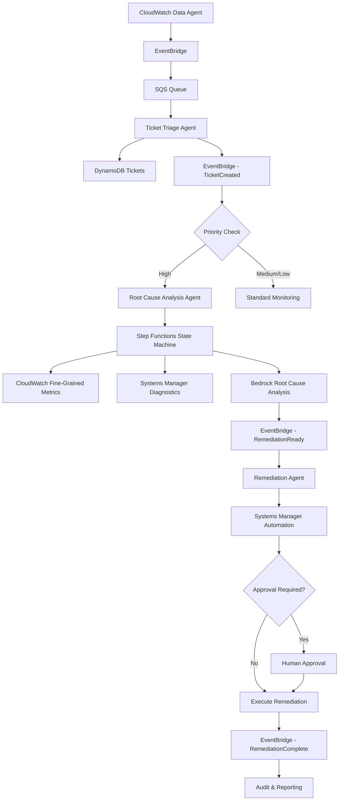

# Multi-Agent CloudWatch Monitoring System

## Use Case
Automated monitoring and incident response system that continuously monitors application and infrastructure metrics, automatically triages issues, performs root cause analysis, and executes remediation actions with minimal human intervention.

## Pain Points
- **Manual Monitoring**: Operations teams spend significant time manually monitoring dashboards and alerts
- **Slow Response Times**: Critical issues may go unnoticed or take too long to escalate
- **Context Switching**: Engineers must switch between multiple tools and dashboards to understand issues
- **Inconsistent Triage**: Different team members may prioritize incidents differently
- **Delayed Root Cause Analysis**: Time-consuming manual investigation of complex issues
- **Reactive Remediation**: Fixes are applied after significant impact has occurred

## Solution
A multi-agent system that automates the entire incident response pipeline from detection to resolution using AWS services and AI agents for intelligent decision-making.

## Agents

### 1. CloudWatch Data Agent (MCP Server)
**Purpose**: Continuously fetch CPU, memory, error-rate metrics and log events for applications and infrastructure.

**Implementation**:
- Deploy a FastMCP server that wraps Python code calling `GetMetricData` and `GetMetricData Insights` queries via the CloudWatch API
- Retrieve log streams using `FilterLogEvents` to capture error traces
- Publish all findings as custom events to an Amazon EventBridge event bus
- Uses its own MCP server with specialized tools for AWS CloudWatch integration
- Additional tools will be added to enhance monitoring capabilities

### 2. Ticket Triage Agent (AWS Lambda + Amazon Bedrock)
**Purpose**: Convert raw metric/log events into prioritized support tickets.

**Trigger**: Rules on the EventBridge bus forward matching CloudWatch events to an SQS queue.

**Implementation**:
- Lambda function polls the queue; for each event, it calls Amazon Bedrock (e.g., `invokeModel`) to classify the issue type (e.g., "database latency", "outage") and urgency (high/medium/low)
- Writes structured tickets to a DynamoDB table, including priority tags and event context
- Emits a "TicketCreated" event back onto EventBridge for downstream agents
- Utilizes its own MCP server with tools for ticket management and classification
- Additional tools will be added for enhanced triage capabilities

### 3. Root Cause Analysis Agent (AWS Step Functions)
**Purpose**: For high-priority tickets, orchestrate deeper diagnostics across data sources.

**Trigger**: Listens for "TicketCreated" events with priority = high.

**Orchestration**:
- Step Functions state machine coordinates:
  - Invoke CloudWatch Data Agent (via a Lambda activity) for fine-grained metrics (e.g., percentile latency)
  - Run Systems Manager Automation runbook to collect instance-level diagnostics (e.g., memory dumps, disk I/O stats)
  - Invoke Bedrock again to summarize diagnostic outputs and suggest probable root causes
- Implements best practices: timeouts, error handling, and payload size limits
- Operates with its own MCP server providing diagnostic and analysis tools
- Additional tools will be added to expand root cause analysis capabilities

### 4. Remediation Agent (AWS Systems Manager Automation)
**Purpose**: Execute safe, automated fixes based on analysis.

**Trigger**: A "RemediationReady" event from the Step Functions machine.

**Implementation**:
- Use AWS Systems Manager Automation runbooks to perform actions such as restarting EC2 instances, scaling Auto Scaling groups, or patching configurations
- Parameterize runbooks to require optional human approval for risky operations via an "approval" step
- Emit "RemediationComplete" or "RemediationFailed" events for auditing and reporting
- Equipped with its own MCP server containing remediation and automation tools
- Additional tools will be added to enhance automated remediation capabilities

## Agent Components

### Core Technologies
- **MCP (Model Context Protocol)**: For agent communication and context sharing
- **Amazon Bedrock**: Primary model provider for AI-powered classification and analysis
- **AWS Lambda**: Serverless compute for event processing
- **Amazon EventBridge**: Event-driven architecture backbone
- **AWS Step Functions**: Workflow orchestration
- **Amazon DynamoDB**: Ticket and state storage
- **Amazon SQS**: Message queuing for reliable processing
- **AWS Systems Manager**: Automation and remediation actions

### Data Flow
1. **Metrics Collection**: CloudWatch APIs → MCP Server → EventBridge
2. **Event Processing**: EventBridge → SQS → Lambda → Bedrock
3. **Ticket Storage**: Lambda → DynamoDB → EventBridge
4. **Analysis Orchestration**: EventBridge → Step Functions → Multiple AWS Services
5. **Remediation**: Step Functions → Systems Manager → EventBridge

## Orchestration Flow (Draft #1)

### Flow Steps
1. **Detection**: CloudWatch Data Agent continuously monitors metrics and logs
2. **Event Publishing**: Anomalies and issues are published to EventBridge
3. **Triage**: Ticket Triage Agent classifies and prioritizes issues using AI
4. **Storage**: Tickets are stored in DynamoDB with metadata
5. **Analysis Trigger**: High-priority tickets trigger root cause analysis
6. **Orchestration**: Step Functions coordinates multi-step diagnostic process
7. **AI Analysis**: Bedrock analyzes collected data and suggests root causes
8. **Remediation Planning**: System determines appropriate remediation actions
9. **Approval Gate**: Optional human approval for risky operations
10. **Execution**: Automated remediation via Systems Manager
11. **Completion**: Results are logged and reported for audit trail

## Implementation Notes
- **Multi-Framework Support**: Agents will be built using different frameworks to demonstrate flexibility and best practices across various development approaches
- **Extensible Design**: Each agent's MCP server can be extended with additional tools as requirements evolve
- **Model Provider**: Amazon Bedrock serves as the exclusive model provider for all AI-powered functionality

## Benefits
- **Reduced MTTR**: Automated detection and response significantly reduces mean time to resolution
- **Consistent Triage**: AI-powered classification ensures consistent prioritization
- **Proactive Monitoring**: Continuous monitoring prevents issues from escalating
- **Audit Trail**: Complete event history for compliance and post-incident analysis
- **Scalable Architecture**: Event-driven design scales with infrastructure growth