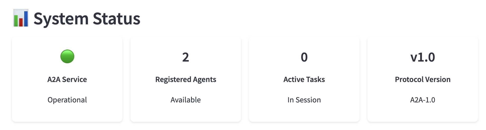
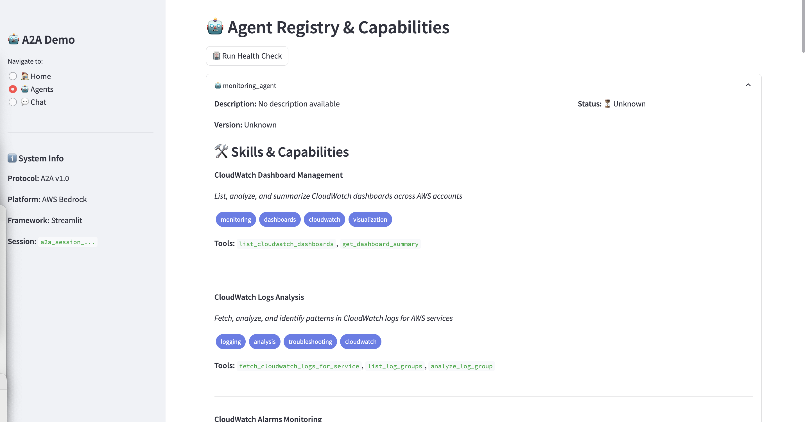

# Multi-Agent System with AWS Bedrock AgentCore: Comprehensive Guide


Welcome to the comprehensive documentation for the A2A Multi-Agents AgentCore system - a sophisticated multi-agent framework built on AWS Bedrock AgentCore for automated operations, monitoring, and incident management.

## System Overview

This multi-agent system demonstrates sophisticated implementation of AWS Bedrock AgentCore primitives through two coordinated agents: a **Monitoring Agent** for AWS resource analysis and an **Ops Orchestrator Agent** for automated incident management and operations coordination.



### Key Features

**Enterprise-Grade Architecture**: Built on AWS Bedrock AgentCore with proper authentication, memory management, and observability
**Multi-Agent Collaboration**: Sophisticated agent-to-agent coordination for complex operational workflows
**Comprehensive AWS Integration**: Deep integration with CloudWatch, JIRA, GitHub, and other enterprise services
**Advanced Memory Management**: Persistent memory across sessions with semantic understanding and user preferences
**Secure Gateway Architecture**: MCP-based gateway with OAuth2/JWT authentication and proper access controls
**Production-Ready Deployment**: Supports both local development and managed cloud deployment modes

## AWS Bedrock AgentCore Primitives


Your implementation showcases sophisticated usage of AWS Bedrock AgentCore's modern primitives, representing current best practices in enterprise AI agent development.

### Memory Management Primitives

**User Preference Memory Strategy**: Maintains user-specific configurations and preferences, allowing agents to adapt their behavior based on individual needs and past interactions. Uses namespace isolation (`/users/{actorId}`) to ensure proper data separation.

**Semantic Memory Strategy**: Provides contextual understanding and knowledge retention across sessions. Enables agents to build understanding of your environment, recognize patterns, and apply previous learning to new situations.

**Summary Memory Strategy**: Maintains session-level summaries and conversation context, ensuring coherent conversations across multiple interactions while managing context window limitations effectively.

**Custom Memory Strategies**: Specialized memory implementations for specific use cases like monitoring issue tracking and incident response patterns. These strategies use custom extraction and consolidation prompts optimized for technical content.

## Agent Registry & A2A Communication



The system supports multiple communication patterns:

**Direct Invocation**: Each agent can be invoked directly for specific tasks
**Agent-to-Agent (A2A)**: Agents can communicate with each other for coordinated workflows
**Gateway-Mediated**: All external service interactions go through the secure MCP gateway
**Memory-Shared**: Agents can access shared memory contexts for coordination

### A2A Protocol Features

- **Intelligent Agent Routing**: Automatically routes requests to the most appropriate agent based on task type and capabilities
- **Task Coordination**: Enables complex multi-step workflows that span multiple agents
- **Context Preservation**: Maintains conversation context across agent handoffs
- **Session Management**: Tracks multi-agent conversations and task lifecycles
- **Health Monitoring**: Real-time monitoring of agent status and availability

## System Components

### 🔍 Monitoring Agent
AWS Bedrock AgentCore runtime for monitoring CloudWatch logs, metrics, dashboards, and other AWS services.

**Core Capabilities**:
- **CloudWatch Integration**: Complete integration with CloudWatch logs, metrics, dashboards, and alarms
- **Intelligent Analysis**: Uses advanced language models to analyze log patterns and identify anomalies
- **Dashboard Management**: Can list, analyze, and summarize CloudWatch dashboards
- **Alarm Coordination**: Retrieves and analyzes CloudWatch alarms with remediation suggestions

### 🤝 Ops Orchestrator Agent  
Multi-agent system for automated incident triaging, ChatOps collaboration, and report generation.

**Multi-Agent Architecture**:
- **Lead Agent (Issue Triaging)**: Analyzes incidents and coordinates response actions
- **ChatOps Agent**: Integrates with Teams, Slack, and Gmail for team coordination
- **Ticket Creator Agent**: Handles automated ticket creation in JIRA and PagerDuty

## Service Integrations


### JIRA Integration
Comprehensive JIRA REST API integration supporting issue creation, updates, project management, and workflow automation. Includes proper authentication with API tokens and robust error handling.

### GitHub Integration
Full GitHub API integration for repository management, issue tracking, gist creation, and documentation maintenance. Supports both public and private repositories with appropriate permission handling.

### Communication Platforms
Integration with major communication platforms for real-time notifications, status updates, and team coordination during incident response.

## ChatOps Integration


The ChatOps integration provides:
- **Real-time Notifications**: Instant alerts and updates to relevant team channels
- **Interactive Commands**: Direct agent interaction through chat interfaces
- **Status Updates**: Automated progress reports during incident resolution
- **Team Coordination**: Seamless collaboration between human operators and AI agents

## Quick Start

### Prerequisites

1. **AWS Account and Credentials**: Ensure AWS credentials are configured
2. **IAM Execution Role**: Create an IAM role with permissions for:
   - Amazon Bedrock access
   - CloudWatch logs/metrics access  
   - Any other AWS services the agent needs
3. **Required Python Packages**: Install dependencies from requirements.txt

### Environment Setup

Create a `.env` file or export the following environment variables:

```bash
# AWS Configuration
export AWS_REGION="us-east-1"
export AWS_ACCOUNT_ID="your-account-id"

# JIRA Integration
export JIRA_USERNAME="your-jira-username"
export JIRA_API_TOKEN="your-jira-api-token"
export JIRA_DOMAIN="yourcompany.atlassian.net"

# GitHub Integration
export GITHUB_TOKEN="ghp_your_github_token"
```

## Architecture Deep Dive

```
┌─────────────────────────────────────────────────────────────┐
│                    AWS Bedrock AgentCore                    │
├─────────────────────────────────────────────────────────────┤
│  ┌─────────────────────┐    ┌─────────────────────────────┐ │
│  │   Monitoring Agent  │    │   Ops Orchestrator Agent   │ │
│  │                     │    │                             │ │
│  │ • CloudWatch Logs   │    │ • Lead Agent (Triaging)    │ │
│  │ • Metrics Analysis  │    │ • ChatOps Agent             │ │
│  │ • Dashboard Review  │    │ • Ticket Creator Agent     │ │
│  │ • Alarm Management  │    │ • Multi-Agent Coordination │ │
│  └─────────────────────┘    └─────────────────────────────┘ │
├─────────────────────────────────────────────────────────────┤
│                    Shared Infrastructure                    │
│  ┌─────────────────────────────────────────────────────────┐ │
│  │ • Memory Management (User Prefs, Semantic, Summary)    │ │
│  │ • MCP Gateway (Authentication, Tool Integration)       │ │
│  │ • Observability (OpenTelemetry, CloudWatch Logging)   │ │
│  │ • Runtime Management (AgentCore Runtime, Local Mode)  │ │
│  └─────────────────────────────────────────────────────────┘ │
└─────────────────────────────────────────────────────────────┘
```

## Getting Started

Choose your agent based on your needs:

- **For AWS Monitoring**: Start with the [Monitoring Agent](monitoring-agent.md)
- **For Operations Management**: Begin with the [Ops Orchestrator Agent](ops-orchestrator-agent.md)

## Bring Your Own Agent (BYOA)

The A2A framework supports bringing your own custom agents into the ecosystem. Here's how:

### Agent Requirements

1. **AWS Bedrock AgentCore Compatibility**: Your agent must be built using AWS Bedrock AgentCore primitives
2. **Memory Management**: Implement proper memory strategies for context preservation
3. **A2A Protocol Support**: Include capability cards and communication interfaces
4. **Authentication**: Support for OAuth2/JWT authentication through the MCP gateway

### Integration Steps

1. **Create Agent Card**: Define your agent's capabilities in JSON format
2. **Register with A2A**: Add your agent to the agent registry
3. **Implement Communication**: Support standardized request/response patterns
4. **Deploy Runtime**: Deploy your agent to AWS Bedrock AgentCore
5. **Test Integration**: Verify A2A communication and coordination

### Example Agent Card

```json
{
  "agent_name": "custom_agent",
  "description": "Custom agent for specialized tasks",
  "capabilities": [
    {
      "category": "analysis",
      "skills": ["data_processing", "report_generation"]
    }
  ],
  "interfaces": {
    "a2a_protocol": "v1.0",
    "authentication": "oauth2",
    "memory_support": true
  }
}
```

## Security Best Practices

1. **Credential Management**
   - Use environment variables, not hardcoded credentials
   - Rotate API tokens regularly
   - Use IAM roles with minimal required permissions

2. **Network Security**
   - Use HTTPS for all external API calls
   - Implement VPC endpoints for AWS services
   - Consider private subnets for production deployments

3. **Access Control**
   - Implement least-privilege IAM policies
   - Use OAuth2 scopes to limit API access
   - Regularly audit service integrations

## Support

For issues and questions:
1. Check the troubleshooting sections in each agent's documentation
2. Review AWS CloudWatch logs
3. Verify configuration against examples
4. Check service status of integrated APIs

---

*This documentation provides comprehensive guidance for deploying and using the A2A Multi-Agents AgentCore system with AWS Bedrock.*