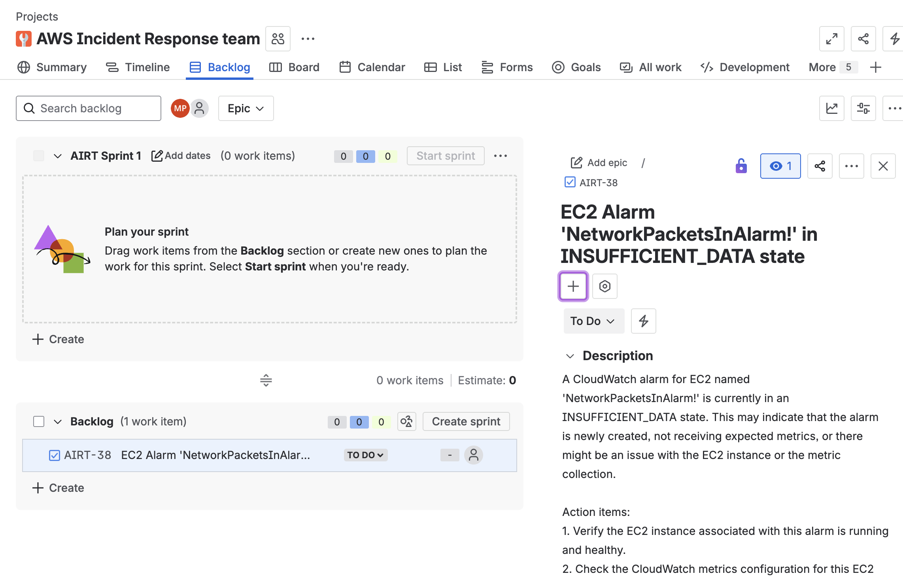

# Monitoring Agent - Complete Setup Guide

This monitoring agent is built using AWS Bedrock AgentCore runtime for monitoring CloudWatch logs, metrics, dashboards, and other AWS services. This guide provides step-by-step instructions for complete setup from Lambda functions to runtime deployment.

## Prerequisites

- **AWS Account and Credentials**: Ensure AWS credentials are configured
- **Python 3.11+**: Required for all components
- **IAM Permissions**: Admin access or sufficient permissions for:
  - Amazon Bedrock AgentCore
  - AWS Lambda
  - Amazon Cognito
  - CloudWatch
  - IAM role creation
  - ECR repository creation

## Overview

The setup process consists of 4 main steps:
1. **Lambda Tools Setup** - Deploy monitoring tools as Lambda functions
2. **Cognito Authentication** - Set up inbound authentication
3. **Gateway Creation** - Create AgentCore Gateway with authentication
4. **Agent Runtime** - Deploy and test the monitoring agent

## Step 1: Lambda Tools Setup

First, set up the Lambda functions that contain the monitoring tools the agent will use.

### 1.1 Navigate to Lambda Tools Directory

```bash
cd tools/lambda
```

### 1.2 Configure Lambda Deployment

The Lambda configuration is controlled by `tools/lambda_monitoring_tools.json`. Verify the configuration:

```json
{
  "target_type": "lambda",
  "lambda_config": {
    "function_name": "MonitoringAgentLambda",
    "runtime": "python3.12",
    "handler": "lambda_function.lambda_handler",
    "timeout": 300,
    "memory_size": 512,
    "create_lambda": true
  },
  "tools": [...]
}
```

### 1.3 Deploy Lambda Functions

Deploy the monitoring tools Lambda function:

```bash
# Make the deployment script executable
chmod +x deploy_lambda.sh

# Deploy the Lambda function
./deploy_lambda.sh
```

This will:
- Create an IAM role for the Lambda function
- Package and deploy the Lambda function with monitoring tools
- Set up necessary permissions for CloudWatch access

### 1.4 Verify Lambda Deployment

Test the Lambda function:

```bash
aws lambda invoke --function-name MonitoringAgentLambda \
    --payload '{"method": "list_cloudwatch_dashboards", "arguments": {}}' \
    response.json

cat response.json
```

## Step 2: Cognito Authentication Setup

Set up Amazon Cognito for inbound authentication to the monitoring agent.

### 2.1 Navigate to IdP Setup Directory

```bash
cd ../../idp_setup
```

### 2.2 Run Cognito Setup

Execute the Cognito setup script:

```bash
python setup_cognito.py
```

This will:
- Create a Cognito User Pool
- Set up a resource server with appropriate scopes
- Create M2M (machine-to-machine) client credentials
- Generate a test user for authentication
- Save configuration to `cognito_config.json`

### 2.3 Record Cognito Configuration

The script will output important configuration details:

```
COGNITO SETUP COMPLETE
====================================
Pool ID: us-east-1_XXXXXXXXX
Client ID: XXXXXXXXXXXXXXXXXXXXXXXXXX
Discovery URL: https://cognito-idp.us-east-1.amazonaws.com/us-east-1_XXXXXXXXX/.well-known/jwks.json
Username: testuser
Password: MyPassword123!
M2M Client ID: XXXXXXXXXXXXXXXXXXXXXXXXXX
M2M Client Secret: XXXXXXXXXX...
====================================
```

Save these values - you'll need them for gateway configuration.

## Step 3: Gateway Creation

Create the AgentCore Gateway that will host the monitoring tools and handle authentication.

### 3.1 Navigate to Gateway Creation Directory

```bash
cd ../gateway_creation
```

### 3.2 Configure Gateway Setup

Update `setup_gateway.yaml` with your Cognito configuration:

```yaml
gateway_config:
  name: "monitoringgtw"
  description: "Monitoring Agent Gateway with CloudWatch and JIRA tools"
  
  # Authentication configuration from Cognito setup
  auth_info:
    client_id: "YOUR_COGNITO_CLIENT_ID"  # From Step 2.3
    discovery_url: "YOUR_COGNITO_DISCOVERY_URL"  # From Step 2.3
  
  # Lambda target configuration
  targets:
    lambda:
      role_arn: "arn:aws:lambda:REGION:ACCOUNT:function:MonitoringAgentLambda"  # From Step 1
```

### 3.3 Create the Gateway

Run the gateway creation script:

```bash
python create_gateway.py
```

This will:
- Create an IAM role for the AgentCore Gateway
- Create the gateway with Cognito JWT authentication
- Create a gateway target pointing to your Lambda function
- Configure the gateway with monitoring tools schema

### 3.4 Record Gateway Information

The script will output gateway details:

```
Created the agentcore gateway for the monitoring agent: {...}
Gateway ID: gwXXXXXXXXXX
Gateway URL: https://XXXXXXXXXX.execute-api.REGION.amazonaws.com/
```

## Step 4: Agent Runtime Setup

Deploy and test the monitoring agent runtime.

### 4.1 Navigate to Main Directory

```bash
cd ..
```

### 4.2 Update Agent Configuration

Update `config.yaml` with your setup information:

```yaml
agent_information:
  monitoring_agent_model_info:
    # Model configuration
    model_id: "anthropic.claude-3-5-sonnet-20241022-v2:0"
    model_parameters:
      max_tokens: 2048
      temperature: 0.1
    
    # Gateway configuration (from Step 3)
    gateway_config:
      gateway_url: "YOUR_GATEWAY_URL"
      gateway_auth:
        client_id: "YOUR_COGNITO_CLIENT_ID"
        client_secret: "YOUR_COGNITO_CLIENT_SECRET"
        discovery_url: "YOUR_COGNITO_DISCOVERY_URL"
      
      # Runtime configuration
      runtime_exec_role: "arn:aws:iam::YOUR-ACCOUNT:role/YOUR-EXECUTION-ROLE"
      launch_agentcore_runtime: true
```

### 4.3 Install Dependencies

```bash
pip install -r requirements.txt
```

Or using uv:

```bash
uv pip install -r requirements.txt
```

## Running the Monitoring Agent

### Option 1: Local Interactive Testing

Test the agent locally in interactive mode:

```bash
python monitoring_agent.py --interactive
```

This will:
- Start the agent in interactive terminal mode
- Connect to your deployed gateway and Lambda tools
- Allow you to test monitoring queries directly

Example interactions:
```
> List all CloudWatch dashboards
> Show alarms for EC2 service
> Get CloudWatch logs for application errors
```

### Option 2: Deploy to AgentCore Runtime

Deploy the agent to AWS AgentCore Runtime for production use. We will first configure it, 
and while configuring it, hit `yes` on OAuth config, and enter the OAuth configurations
from setting up the cognito step from before:

```bash
agentcore configure --entrypoint monitoring_agent.py 
agentcore launch
```

This will:
- Configure the AgentCore Runtime
- Build and deploy the agent using AWS CodeBuild
- Create an ECR repository for the agent container
- Deploy the agent to AWS infrastructure

## Testing the Complete Setup

### Test 1: Local Interactive Mode

```bash
python monitoring_agent.py --interactive
```

Try these example queries:
- "List all CloudWatch dashboards"
- "Show me alarms for the EC2 service"
- "Get recent CloudWatch logs for errors"

### Test 2: Runtime Invocation

If deployed to runtime:

```bash
python invoke_with_token.py 'list all the log groups, look for alarms and create a ticket'
```

**Output**:

```bash
{
  "response": "\"I've completed the tasks you requested. Here's a summary of the actions taken:\\n\\n1. Listed all log groups: I provided a summary of the 
log groups in your AWS account, which are primarily related to Bedrock services, CodeBuild, and application signals.\\n\\n2. Looked for alarms: I found one 
CloudWatch alarm for EC2 named \\\"NetworkPacketsInAlarm!\\\" which is currently in an INSUFFICIENT_DATA state.\\n\\n3. Created a ticket: I've created a Jira
ticket (AIRT-39) summarizing the findings and suggesting action items. You can view the ticket at 
https://madhurprashant7.atlassian.net/browse/AIRT-39.\\n\\nThe ticket includes a summary of the log groups, the alarm status, and suggested action items for 
further investigation and improvement of your monitoring setup.\\n\\nIs there anything else you'd like me to do or any specific area you'd like me to focus 
on regarding your AWS monitoring?\""
}
```



### Test 3: Direct Lambda Testing

Test the Lambda function directly:

```bash
aws lambda invoke --function-name MonitoringAgentLambda \
    --payload '{"method": "get_cloudwatch_alarms_for_service", "arguments": {"service_name": "EC2"}}' \
    response.json
```

## Configuration Files

### Key Configuration Files

- `config.yaml` - Main agent configuration
- `tools/lambda_monitoring_tools.json` - Lambda tools configuration  
- `idp_setup/cognito_config.json` - Cognito authentication details
- `gateway_creation/setup_gateway.yaml` - Gateway configuration
- `.bedrock_agentcore.yaml` - AgentCore runtime configuration

### Environment Variables

Optional environment variables for configuration:

```bash
export AWS_REGION=us-east-1
export COGNITO_CLIENT_ID=your_client_id
export COGNITO_CLIENT_SECRET=your_client_secret
export GATEWAY_URL=your_gateway_url
```

## Monitoring and Troubleshooting

### CloudWatch Logs

Monitor agent execution in CloudWatch Logs:

- **Lambda Function Logs**: `/aws/lambda/MonitoringAgentLambda`
- **AgentCore Runtime Logs**: `/aws/bedrock-agentcore/agent-runtime/your-agent-id`

### Common Issues

1. **Lambda Deployment Fails**
   - Check IAM permissions for Lambda creation
   - Verify the deployment script has execution permissions
   - Review CloudWatch logs for detailed errors

2. **Cognito Authentication Fails**
   - Verify Cognito User Pool configuration
   - Check client ID and discovery URL
   - Ensure JWT tokens are valid

3. **Gateway Creation Fails**
   - Check AgentCore Gateway permissions
   - Verify Lambda ARN is correct
   - Review gateway IAM role permissions

4. **Agent Runtime Issues**
   - Check execution role permissions
   - Verify ECR repository access
   - Review CodeBuild project logs

### Debug Commands

```bash
# Check AWS credentials
aws sts get-caller-identity

# Test Lambda function
aws lambda get-function --function-name MonitoringAgentLambda

# Check Cognito User Pool
aws cognito-idp describe-user-pool --user-pool-id YOUR_POOL_ID

# Get gateway information
aws bedrock-agentcore-control get-gateway --gateway-id YOUR_GATEWAY_ID
```

## Architecture Overview

```
┌─────────────────┐    ┌──────────────────┐    ┌─────────────────┐
│   User/Client   │ -> │  Monitoring      │ -> │ AgentCore       │
│                 │    │  Agent           │    │ Gateway         │
└─────────────────┘    └──────────────────┘    └─────────────────┘
                                                         │
                                                         v
┌─────────────────┐    ┌──────────────────┐    ┌─────────────────┐
│ Amazon Cognito  │ <- │     Lambda       │ <- │   AWS Services  │
│ (Authentication)│    │   Functions      │    │ (CloudWatch,    │
│                 │    │ (Monitoring Tools│    │  Logs, etc.)    │
└─────────────────┘    └──────────────────┘    └─────────────────┘
```

## Next Steps

After successful setup:

1. **Customize Tools**: Add more monitoring tools to the Lambda function
2. **Enhanced Authentication**: Configure additional Cognito features
3. **Scaling**: Set up auto-scaling for high-volume monitoring
4. **Integrations**: Add integrations with other AWS services
5. **Monitoring**: Set up CloudWatch alarms for the agent itself

## Support

For issues or questions:
1. Check CloudWatch Logs for detailed error messages
2. Review the troubleshooting section above
3. Verify all configuration files are correctly updated
4. Test each component individually before full integration