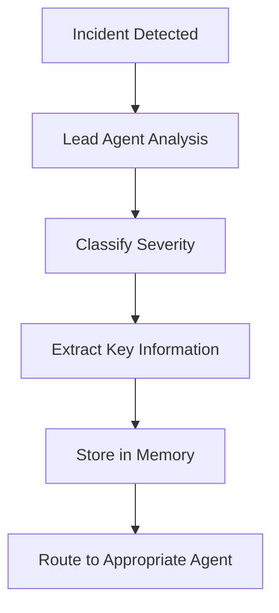
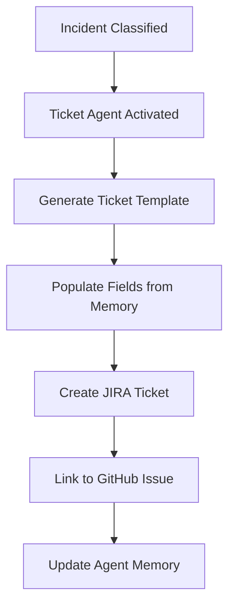
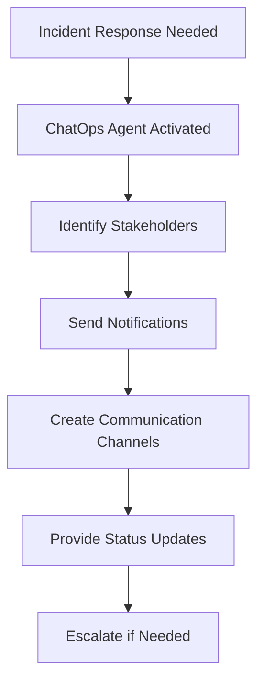

# Ops Orchestrator Multi-Agent System

A comprehensive multi-agent system built on AWS Bedrock AgentCore that provides automated incident triaging, ChatOps collaboration, and report generation for operational workflows.

## 🚀 Quick Start Guide

### Prerequisites
First, ensure you have completed all prerequisite setup as outlined in the [Prerequisites](#prerequisites) section below.

### Local Deployment Steps

1. **Configure and Launch the Agent Runtime**
   ```bash
   python ops_orchestrator_runtime.py --configure --launch
   ```
   This will:
   - Configure the AgentCore runtime environment
   - Set up authentication and gateway connections
   - Launch the ops orchestrator agent with runtime capabilities

2. **Navigate to Parent Directory and Invoke Agent**
   ```bash
   cd ..
   python invoke_agent.py
   ```

3. **Agent Invocation Options**
   You can invoke the agent using either:
   
   **Option A: HTTP/REST API**
   - Use standard HTTP requests to interact with the agent
   - The agent will be accessible via the configured gateway endpoint
   
   **Option B: AWS SDK (boto3)**
   - Use the AWS Bedrock AgentCore SDK for direct agent invocation
   - Requires your agent ARN for programmatic access
   - Example:
     ```python
     import boto3
     client = boto3.client('bedrock-agentcore')
     response = client.invoke_agent(
         agentId='your-agent-arn',
         message='Your incident description here'
     )
     ```

### Summary of Deployment Process
1. ✅ Complete prerequisites setup
2. ✅ Run `python ops_orchestrator_runtime.py --configure --launch`
3. ✅ Navigate up one directory: `cd ..`
4. ✅ Invoke agent: `python invoke_agent.py`
5. ✅ Use HTTP or boto3 for agent communication

## Architecture Overview

The Ops Orchestrator Agent is a sophisticated multi-agent system that consists of three specialized OpenAI agents working collaboratively:

1. **Lead Agent (Issue Triaging)** - Automated incident analysis and classification
2. **ChatOps Agent** - Real-time collaboration through Teams, Slack, and Gmail
3. **Ticket Creator Agent** - Automated ticket creation in JIRA and PagerDuty

Each agent leverages AWS Bedrock AgentCore memory primitives and connects to external services through an MCP (Model Context Protocol) gateway with OAuth2 authentication.

## Prerequisites

### AWS Requirements
- AWS CLI configured with appropriate permissions
- Access to AWS Bedrock AgentCore services
- IAM permissions for:
  - `bedrock:*`
  - `bedrock-agentcore:*`
  - `s3:*`
  - `lambda:*`
  - `iam:*`
  - `cognito-idp:*`
  - `secretsmanager:*`
  - `logs:*`
  - `cloudwatch:*`

### Python Dependencies
```bash
pip install boto3 pyyaml python-keycloak requests openai anthropic
```

### External Service Authentication
You'll need API credentials for the services you want to integrate:
- **JIRA**: Username and API token
- **GitHub**: Personal Access Token or OAuth app credentials
- **Slack**: Bot token (optional)

## 🚀 Quick Start

### 1. Environment Setup

Create a `.env` file or export the following environment variables:

```bash
# AWS Configuration
export AWS_REGION="us-east-1"
export AWS_ACCOUNT_ID="your-account-id"

# JIRA Integration (Required)
export JIRA_USERNAME="your-jira-username"
export JIRA_API_TOKEN="your-jira-api-token"
export JIRA_DOMAIN="yourcompany.atlassian.net"

# GitHub Integration (Required)
export GITHUB_TOKEN="ghp_your_github_token"

# Optional: GitHub OAuth (for advanced features)
export GITHUB_CLIENT_ID="your-oauth-client-id"
export GITHUB_CLIENT_SECRET="your-oauth-client-secret"

# Optional: JIRA OAuth (for advanced features)
export JIRA_CLIENT_ID="your-jira-oauth-client-id"
export JIRA_CLIENT_SECRET="your-jira-oauth-client-secret"

# Optional: Keycloak Authentication (Alternative to Cognito)
export KEYCLOAK_URL="http://localhost:8080/"
export KEYCLOAK_ADMIN_USER="admin"
export KEYCLOAK_ADMIN_PASS="admin"
```

### 2. Configuration Setup

The system uses a `config.yaml` file for configuration. Here's the essential structure:

```yaml
general:
  name: "ops-orchestrator-agent"
  description: "Multi-agent system for operations orchestration"

agent_information:
  ops_orchestrator_agent_model_info: 
    model_id: gpt-4o-2024-08-06
    inference_parameters:
      temperature: 0.1
      max_tokens: 2048
    
    # Memory configuration for each agent
    memories:
      lead_agent:
        use_existing: false  # Set to true if you have existing memory
        memory_id: null      # Fill if reusing existing memory
      chat_ops_agent:
        use_existing: false
        memory_id: null
      ticket_agent:
        use_existing: false
        memory_id: null
    
    # Gateway configuration
    gateway_config:
      name: "ops-gw"
      
      # Authentication method (choose one)
      inbound_auth:
        type: "cognito"  # or "keycloak"
        cognito:
          create_user_pool: true
          user_pool_name: "agentcore-gateway-ops"
          resource_server_id: "ops_orchestrator_agent"
          resource_server_name: "agentcore-gateway-ops"
          client_name: "agentcore-client-ops"
          scopes:
            - ScopeName: "gateway:read"
              ScopeDescription: "Read access"
            - ScopeName: "gateway:write"
              ScopeDescription: "Write access"
      
      credentials:
        use_cognito: true
        use_existing: false
        create_new_access_token: false
        gateway_id: null
        mcp_url: null
        access_token: null
      
      # S3 bucket for storing API specifications
      bucket_name: "ops-orchestrator-gateway-bucket"
      
      # Target integrations
      targets:
        - name: "jira-integration"
          spec_file: /absolute/path/to/tools/jira_api_spec.yaml
          type: "openapi"
          api_type: "jira"
          endpoint: "https://your-jira-instance.atlassian.net"
          authentication:
            type: "basic"
            credentials:
              username: "${JIRA_USERNAME}"
              password: "${JIRA_API_TOKEN}"
        
        - name: "github-integration" 
          spec_file: /absolute/path/to/tools/github_api_spec.yaml
          type: "openapi"
          api_type: "github"
          endpoint: "https://api.github.com"
          authentication:
            type: "bearer"
            credentials:
              token: "${GITHUB_TOKEN}"
```

### 3. Update Configuration Paths

**IMPORTANT**: Update the absolute paths in your `config.yaml`:

```bash
# Get your current directory
pwd

# Update spec_file paths in config.yaml to use absolute paths
# Example:
# spec_file: /Users/yourname/path/to/ops_orchestrator_agent/tools/jira_api_spec.yaml
```

### 4. Run the System

```bash
python ops_orchestrator_multi_agent.py
```

The system will:
1. Initialize AWS Bedrock AgentCore memory for each agent
2. Set up authentication (Cognito or Keycloak)
3. Create an MCP gateway with your service integrations
4. Initialize the three specialized agents
5. Start the collaborative agent system

## 🔐 Authentication Options

### Option 1: AWS Cognito (Default)

The system automatically creates:
- Cognito User Pool for authentication
- Resource server with custom scopes
- Machine-to-machine client for API access
- Access tokens for gateway authentication

Configuration in `config.yaml`:
```yaml
inbound_auth:
  type: "cognito"
  cognito:
    create_user_pool: true
    user_pool_name: "agentcore-gateway-ops"
    # ... other cognito settings
```

### Option 2: Keycloak Authentication

For organizations using Keycloak for identity management:

1. **Start Keycloak** (if running locally):
```bash
docker run -p 8080:8080 \
  -e KEYCLOAK_ADMIN=admin \
  -e KEYCLOAK_ADMIN_PASSWORD=admin \
  quay.io/keycloak/keycloak:latest start-dev
```

2. **Update config.yaml**:
```yaml
inbound_auth:
  type: "keycloak"
  keycloak:
    url: "${KEYCLOAK_URL}"
    admin_user: "${KEYCLOAK_ADMIN_USER}"
    admin_pass: "${KEYCLOAK_ADMIN_PASS}"
    realm_name: "ops-orchestrator-realm"
    client_id: "ops-orchestrator-gateway-client"
    create_realm: true
    scopes:
      - "gateway:read"
      - "gateway:write"
      - "ops:manage"
      - "incidents:create"

credentials:
  use_keycloak: true
```

3. **Set environment variables**:
```bash
export KEYCLOAK_URL="http://localhost:8080/"
export KEYCLOAK_ADMIN_USER="admin"
export KEYCLOAK_ADMIN_PASS="admin"
```

See [README_KEYCLOAK_SETUP.md](README_KEYCLOAK_SETUP.md) for detailed Keycloak configuration.

## 🔧 Service Integrations

### JIRA Integration

The system integrates with JIRA for automated ticket creation and management.

**Required Setup:**
1. Create a JIRA API token in your Atlassian account
2. Set environment variables:
```bash
export JIRA_USERNAME="your-email@company.com"
export JIRA_API_TOKEN="your-api-token"
export JIRA_DOMAIN="yourcompany.atlassian.net"
```

**Configuration in config.yaml:**
```yaml
targets:
  - name: "jira-integration"
    spec_file: /absolute/path/to/tools/jira_api_spec.yaml
    type: "openapi"
    api_type: "jira"
    endpoint: "https://your-jira-instance.atlassian.net"
    authentication:
      type: "basic"
      credentials:
        username: "${JIRA_USERNAME}"
        password: "${JIRA_API_TOKEN}"
```

### GitHub Integration

Integrates with GitHub for repository management and issue tracking.

**Required Setup:**
1. Create a GitHub Personal Access Token with appropriate scopes
2. Set environment variable:
```bash
export GITHUB_TOKEN="ghp_your_github_token"
```

**Configuration in config.yaml:**
```yaml
targets:
  - name: "github-integration"
    spec_file: /absolute/path/to/tools/github_api_spec.yaml
    type: "openapi"
    api_type: "github"
    endpoint: "https://api.github.com"
    authentication:
      type: "bearer"
      credentials:
        token: "${GITHUB_TOKEN}"
```

### Advanced OAuth2 Setup (Optional)

For enhanced security and features, you can set up OAuth2 applications:

**GitHub OAuth App:**
1. Go to GitHub Settings → Developer settings → OAuth Apps
2. Create a new OAuth App
3. Set Authorization callback URL to your gateway URL
4. Note Client ID and Client Secret

**JIRA OAuth App:**
1. Go to Atlassian Developer Console
2. Create a new app with OAuth 2.0 authorization
3. Configure scopes and redirect URIs
4. Note Client ID and Client Secret

## 🧠 Agent Memory System

Each agent uses AWS Bedrock AgentCore memory with different strategies:

### Lead Agent Memory
- **User Preferences**: Stores user-specific incident handling preferences
- **Semantic Memory**: Contextual understanding of technical issues
- **Summary Memory**: Session-based conversation summaries
- **Custom Issue Triaging**: Specialized memory for incident classification

### ChatOps Agent Memory
- **User Preferences**: Communication preferences and channels
- **Semantic Memory**: Chat context and collaboration patterns
- **Summary Memory**: Chat session summaries
- **ChatOps Memory**: Communication templates and escalation procedures

### Ticket Creator Agent Memory  
- **User Preferences**: Ticket creation preferences and templates
- **Semantic Memory**: Ticket patterns and classifications
- **Summary Memory**: Ticket creation session history
- **Ticket Creator Memory**: Template management and field mapping

### Memory Configuration

```yaml
memories:
  lead_agent:
    use_existing: false      # Set to true to reuse existing memory
    memory_id: null          # Memory ID if reusing
  chat_ops_agent:
    use_existing: false
    memory_id: null
  ticket_agent:
    use_existing: false
    memory_id: null
```

When `use_existing: false`, the system creates new memory instances. Set to `true` and provide `memory_id` to reuse existing memory.

## 🔍 Process Flow

### 1. Incident Detection & Triaging


### 2. Automated Ticket Creation


### 3. ChatOps Collaboration


## 📁 Project Structure

```
ops_orchestrator_agent/
├── README.md                           # This file
├── README_KEYCLOAK_SETUP.md           # Keycloak authentication setup
├── config.yaml                        # Main configuration file
├── ops_orchestrator_multi_agent.py    # Main agent system
├── constants.py                       # System constants and paths
├── utils.py                           # Utility functions
├── openAI_memory_tools.py             # Memory management tools
├── setup_keycloack_auth.py            # Keycloak authentication
├── mcp_credentials.json               # Generated gateway credentials
├── custom_memory_prompts/             # Memory extraction prompts
│   └── ops_orchestrator_agent_memory/
│       ├── custom_extraction_prompt_lead_agent.txt
│       ├── ticket_creator_agent_memory.txt
│       └── chat_report_agent_memory.txt
├── prompt_template/                   # Agent system prompts
│   └── ops_orchestrator_agent_prompt.txt
└── tools/                            # API specifications
    ├── jira_api_spec.yaml
    └── github_api_spec.yaml
```

## 🛠️ Troubleshooting

### Common Issues

#### 1. Memory Creation Fails
```
❌ Error creating memory for agent: AccessDenied
```
**Solution**: Check AWS permissions for `bedrock-agentcore:*`

#### 2. Gateway Creation Fails
```
❌ Error creating gateway: ValidationException
```
**Solutions**:
- Verify AWS region supports Bedrock AgentCore
- Check IAM role permissions
- Validate authentication configuration

#### 3. JIRA/GitHub Integration Fails
```
❌ Target creation failed: Authentication failed
```
**Solutions**:
- Verify API credentials are correct
- Check environment variables are exported
- Validate API endpoint URLs
- Ensure API tokens have required permissions

#### 4. Token Refresh Issues
```
⚠️ attempting refresh of the token...
```
**Solutions**:
- Set `create_new_access_token: true` in config
- Check Cognito/Keycloak server availability
- Verify client credentials

### Debug Mode

Enable detailed logging:
```bash
export PYTHONPATH=.
python -c "
import logging
logging.basicConfig(level=logging.DEBUG)
exec(open('ops_orchestrator_multi_agent.py').read())
"
```

### Credential Files

The system generates several credential files:
- `mcp_credentials.json` - Gateway access credentials
- `keycloak_gateway_credentials.json` - Keycloak credentials (if using Keycloak)

## 🔄 Configuration Management

### Memory Reuse

To reuse existing agent memories:
1. Run the system once to create memories
2. Note the memory IDs from the logs
3. Update `config.yaml`:
```yaml
memories:
  lead_agent:
    use_existing: true
    memory_id: "OpsAgent_mem_1234567890-abcdef"
  chat_ops_agent:
    use_existing: true
    memory_id: "OpsAgent_chat_1234567890-ghijkl"
  ticket_agent:
    use_existing: true
    memory_id: "TicketCreation_chat_1234567890-mnopqr"
```

### Gateway Reuse

To reuse an existing gateway:
1. Set up the gateway once
2. Copy credentials from `mcp_credentials.json`
3. Update `config.yaml`:
```yaml
credentials:
  use_existing: true
  gateway_id: "gw-1234567890abcdef"
  mcp_url: "https://xxxxx.execute-api.region.amazonaws.com/"
  access_token: "your-access-token"
```

## 🧪 Testing

### Test Authentication Setup
```bash
# Test Cognito setup
python -c "from utils import setup_cognito_user_pool; setup_cognito_user_pool()"

# Test Keycloak setup
python run_keycloak_setup.py
```

### Test Gateway Connectivity
```bash
python -c "
from ops_orchestrator_multi_agent import *
# This will test gateway creation and connectivity
"
```

### Test Service Integrations
Verify your API credentials:
```bash
# Test JIRA
curl -u $JIRA_USERNAME:$JIRA_API_TOKEN https://$JIRA_DOMAIN/rest/api/2/myself

# Test GitHub
curl -H "Authorization: token $GITHUB_TOKEN" https://api.github.com/user
```

## 📊 Monitoring & Observability

The system includes built-in observability:

### CloudWatch Integration
- Automatic log group creation: `/aws/bedrock-log-group`
- Session tracking with unique IDs
- Performance metrics and traces

### OpenTelemetry Support
Install for enhanced observability:
```bash
pip install aws-opentelemetry-distro
```

Enable in environment:
```bash
export ENABLE_OBSERVABILITY=true
```

## 🔐 Security Best Practices

### 1. Credential Management
- Use environment variables, not hardcoded credentials
- Rotate API tokens regularly
- Use IAM roles with minimal required permissions

### 2. Network Security
- Use HTTPS for all external API calls
- Implement VPC endpoints for AWS services
- Consider private subnets for production deployments

### 3. Access Control
- Implement least-privilege IAM policies
- Use OAuth2 scopes to limit API access
- Regularly audit service integrations

## 📈 Scaling Considerations

### Production Deployment
- Use AWS Secrets Manager for credential management
- Implement proper error handling and retries
- Set up CloudWatch alarms for system health
- Use AWS Lambda for serverless execution

### Multi-Environment Setup
- Separate configurations per environment
- Use different S3 buckets and memory instances
- Implement proper CI/CD pipelines

## 🤝 Contributing

1. Fork the repository
2. Create a feature branch
3. Make your changes
4. Test thoroughly
5. Submit a pull request

## 📝 License

This project is licensed under the MIT License - see the LICENSE file for details.

## 🆘 Support

For issues and questions:
1. Check the troubleshooting section
2. Review AWS CloudWatch logs
3. Verify configuration against examples
4. Check service status of integrated APIs

## 🎉 Success Indicators

When properly configured, you should see:
```
✅ Observability initialized
✅ Created memory for lead_agent: OpsAgent_mem_xxx
✅ Created memory for chat_ops_agent: OpsAgent_chat_xxx  
✅ Created memory for ticket_agent: TicketCreation_chat_xxx
✅ Gateway setup completed with URL: https://xxxxx
✅ Created 2 targets successfully
🚀 Ops orchestrator multi-agent system ready!
```

Your multi-agent system is now ready to handle operational incidents, create tickets, and collaborate across your organization! 🚀