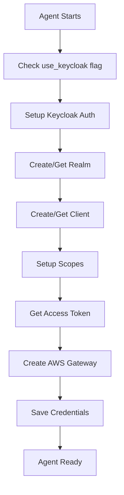

# Keycloak Authentication Setup for Ops Orchestrator Agent

This document provides complete instructions for setting up Keycloak authentication to replace Cognito in the Ops Orchestrator Agent gateway.

## 📋 Overview

The Ops Orchestrator Agent now supports Keycloak OpenID Connect authentication instead of AWS Cognito. This provides better integration with existing identity management systems and more flexible authentication workflows.

## 🔧 Prerequisites

### 1. Keycloak Server
- Keycloak server running (local or remote)
- Admin access to create realms and clients
- Default setup assumes Keycloak on `http://localhost:8080/`

### 2. Python Dependencies
```bash
pip install python-keycloak boto3 pyyaml
```

### 3. AWS Credentials
- AWS CLI configured with appropriate permissions
- Access to AWS Bedrock AgentCore services

## 🚀 Quick Start

### Step 1: Environment Variables
Set up the required environment variables:

```bash
# Keycloak Configuration
export KEYCLOAK_URL="http://localhost:8080/"
export KEYCLOAK_ADMIN_USER="admin"
export KEYCLOAK_ADMIN_PASS="admin"

# Optional: AWS Configuration
export AWS_REGION="us-east-1"
export AWS_ACCOUNT_ID="your-account-id"
```

### Step 2: Update Configuration
Update your `config.yaml` file with Keycloak settings:

```yaml
agent_information:
  ops_orchestrator_agent_model_info:
    gateway_config:
      name: "OpsOrchestratorGatewayKeycloak"
      
      # Enable Keycloak authentication
      credentials:
        use_keycloak: true          # 🔑 Enable Keycloak
        use_existing: false
        create_new_access_token: false
      
      # Keycloak configuration
      inbound_auth:
        keycloak:
          url: "${KEYCLOAK_URL}"
          admin_user: "${KEYCLOAK_ADMIN_USER}"
          admin_pass: "${KEYCLOAK_ADMIN_PASS}"
          realm_name: "ops-orchestrator-realm"
          client_id: "ops-orchestrator-gateway-client"
          create_realm: true
          scopes:
            - "gateway:read"
            - "gateway:write"
            - "ops:manage"
            - "incidents:create"
```

### Step 3: Run the Setup
Execute the ops orchestrator agent:

```bash
python ops_orchestrator_multi_agent.py
```

Or test the setup first:

```bash
python run_keycloak_setup.py
```

## 📁 File Structure

```
ops_orchestrator_agent/
├── setup_keycloack_auth.py           # 🔑 Main Keycloak authentication module
├── ops_orchestrator_multi_agent.py   # 🤖 Modified agent with Keycloak support
├── gateway_keycloak_integration.py   # 🌉 Gateway integration helpers
├── config_keycloak_example.yaml      # 📋 Example configuration
├── run_keycloak_setup.py            # 🧪 Test script
└── README_KEYCLOAK_SETUP.md         # 📖 This file
```

## 🔧 Detailed Setup Instructions

### 1. Keycloak Server Setup

#### Option A: Local Keycloak (Docker)
```bash
docker run -p 8080:8080 -e KEYCLOAK_ADMIN=admin -e KEYCLOAK_ADMIN_PASSWORD=admin \
  quay.io/keycloak/keycloak:latest start-dev
```

#### Option B: Existing Keycloak Server
Update `KEYCLOAK_URL` to point to your server:
```bash
export KEYCLOAK_URL="https://your-keycloak-server.com/"
```

### 2. Configuration Details

#### Realm Configuration
- **Name**: `ops-orchestrator-realm`
- **Auto-created**: Yes (if `create_realm: true`)
- **Purpose**: Isolated authentication domain for the agent

#### Client Configuration
- **Client ID**: `ops-orchestrator-gateway-client`
- **Type**: Confidential (service account)
- **Grant**: Client Credentials
- **Scopes**: Custom scopes for gateway operations

#### Scopes
- `gateway:read` - Read access to gateway resources
- `gateway:write` - Write access to gateway resources
- `ops:manage` - Operations management permissions
- `incidents:create` - Incident creation permissions

### 3. Authentication Flow



## 🔍 Troubleshooting

### Common Issues

#### 1. Keycloak Connection Failed
```
❌ Failed to connect to Keycloak admin: <error>
```
**Solutions:**
- Check Keycloak server is running
- Verify `KEYCLOAK_URL` is correct
- Ensure admin credentials are valid

#### 2. Realm Creation Failed
```
❌ Error with realm setup: <error>
```
**Solutions:**
- Set `create_realm: false` if realm exists
- Check admin user has realm creation permissions
- Verify realm name doesn't conflict

#### 3. AWS Gateway Creation Failed
```
❌ Error setting up Keycloak gateway: <error>
```
**Solutions:**
- Check AWS credentials and permissions
- Verify Bedrock AgentCore access
- Check IAM role creation permissions

#### 4. Token Generation Failed
```
❌ Error getting access token: <error>
```
**Solutions:**
- Verify client configuration
- Check scopes are properly configured
- Ensure service account is enabled

### Debug Mode
Enable detailed logging:

```python
import logging
logging.getLogger().setLevel(logging.DEBUG)
```

Or set environment variable:
```bash
export PYTHONPATH=. && python -c "
import logging
logging.basicConfig(level=logging.DEBUG)
exec(open('ops_orchestrator_multi_agent.py').read())
"
```

## 📊 Validation

### Test Keycloak Setup
```bash
python run_keycloak_setup.py
```

Expected output:
```
✅ Keycloak environment variables are set
🔧 Running Keycloak setup...
✅ Created realm: ops-orchestrator-realm
✅ Created client: ops-orchestrator-gateway-client
✅ Created scope: gateway:read
✅ Created scope: gateway:write
✅ Obtained access token: eyJhbGciOiJSUzI1NiI...
✅ Complete Keycloak authentication setup finished!
```

### Verify Gateway Creation
Check AWS Console for:
- New Bedrock AgentCore Gateway
- Keycloak discovery URL configured
- Custom JWT authorizer active

### Test Token Validity
The generated JWT token should:
- Be valid for the configured TTL
- Include the custom scopes
- Work with AWS Gateway authentication

## 🔄 Token Refresh

### Automatic Refresh
Set in configuration:
```yaml
credentials:
  create_new_access_token: true
```

### Manual Refresh
```python
from setup_keycloack_auth import refresh_keycloak_token
new_token = refresh_keycloak_token(config)
```

## 📝 Generated Files

The setup process creates several files:

### 1. Credentials File
`ops_orchestrator_gateway_keycloak_credentials.json`
```json
{
  "gateway_id": "gw-xxxxx",
  "mcp_url": "https://xxxxx.execute-api.region.amazonaws.com/",
  "access_token": "eyJhbGciOiJSUzI1NiI...",
  "auth_type": "keycloak",
  "keycloak": {
    "url": "http://localhost:8080/",
    "realm_name": "ops-orchestrator-realm",
    "client_id": "ops-orchestrator-gateway-client",
    "client_secret": "xxxxx",
    "discovery_url": "http://localhost:8080/realms/ops-orchestrator-realm/.well-known/openid-configuration",
    "scopes": ["gateway:read", "gateway:write"]
  },
  "created_at": 1234567890
}
```

### 2. Test Results
`keycloak_test_results.json` (from test script)

## 🔐 Security Considerations

### 1. Client Secret Security
- Store client secrets securely
- Use environment variables, not hardcoded values
- Rotate secrets regularly

### 2. Token Management
- Monitor token expiration
- Implement automatic refresh
- Use HTTPS for Keycloak communication

### 3. Scope Limitation
- Use minimal required scopes
- Regularly audit scope assignments
- Implement scope-based access control

## 🆚 Keycloak vs Cognito Comparison

| Feature | Keycloak | Cognito |
|---------|----------|---------|
| **Cost** | Free (self-hosted) | Pay per MAU |
| **Customization** | Highly customizable | Limited customization |
| **Integration** | Standards-based OIDC | AWS-native |
| **Hosting** | Self-hosted or cloud | AWS managed |
| **Federation** | Extensive options | Limited options |
| **Compliance** | Full control | AWS compliance |

## 🔧 Advanced Configuration

### Custom Scopes
Add application-specific scopes:

```yaml
keycloak:
  scopes:
    - "gateway:read"
    - "gateway:write"
    - "jira:create-ticket"
    - "slack:send-message"
    - "pagerduty:create-incident"
```

### Multiple Clients
Support multiple services:

```yaml
keycloak:
  clients:
    - id: "ops-orchestrator-gateway"
      scopes: ["gateway:read", "gateway:write"]
    - id: "monitoring-service"
      scopes: ["monitor:read"]
```

### Realm-per-Environment
Separate realms for different environments:

```yaml
keycloak:
  realm_name: "ops-${ENVIRONMENT}"  # ops-dev, ops-prod
```

## 📞 Support

For issues or questions:

1. Check the troubleshooting section above
2. Review Keycloak server logs
3. Check AWS CloudWatch logs
4. Verify configuration against examples

## 🎉 Success!

Once setup is complete, your Ops Orchestrator Agent will:

✅ Authenticate using Keycloak instead of Cognito  
✅ Generate JWT tokens for AWS Gateway access  
✅ Support custom scopes and permissions  
✅ Integrate with existing identity systems  
✅ Provide better security and compliance options  

The agent is now ready to handle operational tasks with Keycloak authentication! 🚀